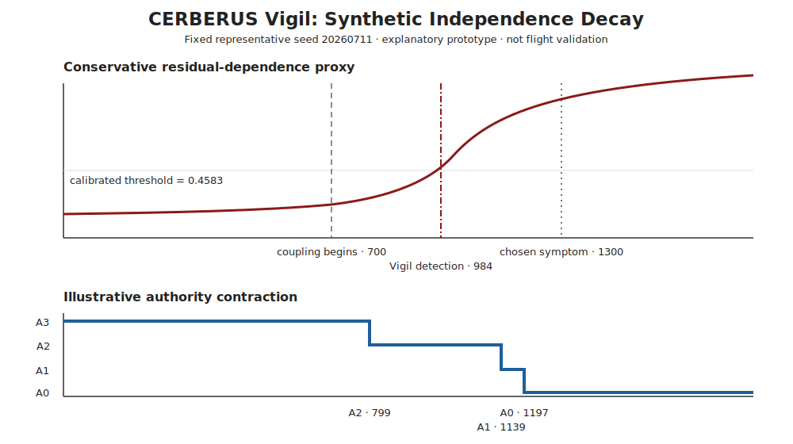

# CERBERUS Vigil Experiment

> A reproducible matched-model pipeline-verification experiment for runtime independence monitoring.

[](https://github.com/emilyecht/cerberus-vigil-experiment/actions/workflows/reproduce.yml)
[](LICENSE)

This repository isolates one implemented experiment from the broader [CERBERUS Runtime Assurance](https://github.com/emilyecht/cerberus-runtime-assurance) architecture.

CERBERUS treats assurance-layer independence as a perishable runtime quantity. This experiment tests a much narrower proposition: after removing a measured common environmental signal from two synthetic channels, a deliberately injected hidden shared pathway should increase residual dependence, a conservative upper bound should move in the adverse direction, and illustrative authority should contract monotonically.

> **Perfect separation is expected when the detector's model matches the data generator. This experiment tests pipeline correctness, fixed-seed reproducibility, and conservative-bound behavior under known ground truth - not realistic detection difficulty or operational performance.**



## Fixed-seed result

| Metric | Result |
|---|---:|
| Calibrated alarm threshold | **0.458326** |
| Nominal sustained-alarm runs | **0 / 200** |
| Coupling detections | **200 / 200** |
| Median detection sample | **1061.5** |
| Median lead before symptom | **238.5 samples** |
| 10th-90th percentile lead | **160.9-319.6 samples** |
| Representative detection | **sample 984** |

The committed machine-readable value is `0.45832639152918053`. The rounded value shown in both repository READMEs is `0.458326`.

The generator creates the same residual-coupling structure that the detector is designed to identify. The result therefore verifies the wiring of conditioning, threshold calibration, persistence logic, conservative-bound computation, fixed-seed reproduction, and illustrative authority transitions. It is not an estimate of spacecraft, production, or model-mismatched detector performance.

## Run it from a fresh clone

```bash
git clone https://github.com/emilyecht/cerberus-vigil-experiment.git
cd cerberus-vigil-experiment
python -m pip install -e ".[dev]"
pytest
python run_experiment.py
```

The final command prints the full summary as JSON. Confirm that `calibrated_alarm_threshold_upper_bound` equals `0.45832639152918053`, which rounds to `0.458326`.

Generated outputs are written to `results/`:

- `summary.json` - machine-readable metrics and configuration
- `monte_carlo_results.csv` - compact metric table
- `representative_trace.csv` - generated full representative signal and authority trace
- `vigil_independence_decay.png` - generated review figure

The repository commits the small reference SVG and summary tables; CI regenerates the full outputs as an artifact.

## Experimental protocol

1. Simulate two channels driven by a measured common environment and independent noise.
2. Estimate each channel's environment response during commissioning.
3. Monitor rolling residual correlation after conditioning.
4. Convert `|r|` to a one-sided 95% Fisher upper confidence bound.
5. Calibrate a sustained-alarm threshold on 100 independent nominal runs.
6. Evaluate on separate sets of 200 nominal and 200 coupling runs.
7. Map higher overlap-proxy values to illustrative A3-A0 authority contraction.

The full method, valid claim, and non-claims are in [docs/method.md](docs/method.md).

## Repository layout

```text
src/cerberus_vigil/    simulation, monitor, output code
run_experiment.py      reproducible entry point
tests/                 deterministic and scientific guardrail tests
results/               committed reference outputs
docs/method.md         protocol, interpretation, and non-claims
.github/workflows/     CI reproduction check
```

## Evidence boundary

**Implemented here:** synthetic data generation, commissioning residualization, rolling residual-correlation monitor, Fisher upper bound, fixed-seed calibration/evaluation, illustrative authority contraction, tests, and reproducible outputs.

**Established here:** the matched-model evidence-to-authority pipeline is internally consistent, deterministic under fixed seeds, and monotonic in the intended adverse-evidence direction.

**Not implemented or validated here:** structural or probabilistic FCOI, realistic detection difficulty, model mismatch, transfer entropy, sentinel injection, spacecraft FDIR, hardware-in-the-loop behavior, promotion/recovery safety, and flight certification.

## License

The code and repository documentation are released under the [MIT License](LICENSE), copyright © 2026 Emily Echterhoff.

## Citation

Citation metadata is provided in [`CITATION.cff`](CITATION.cff).
